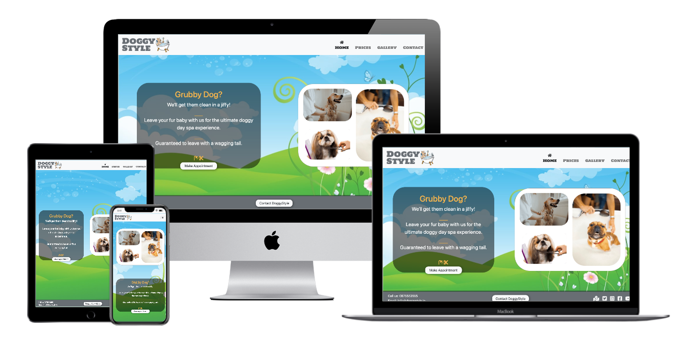
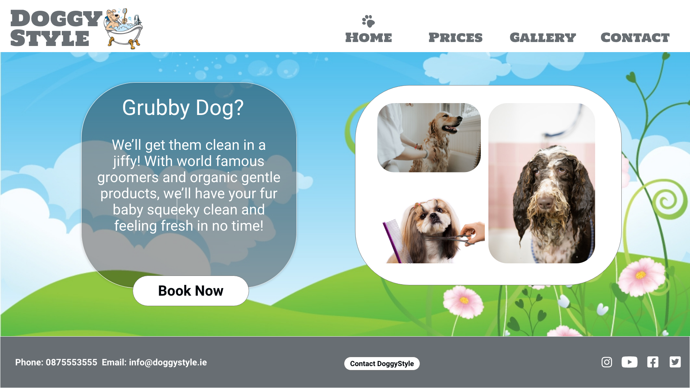
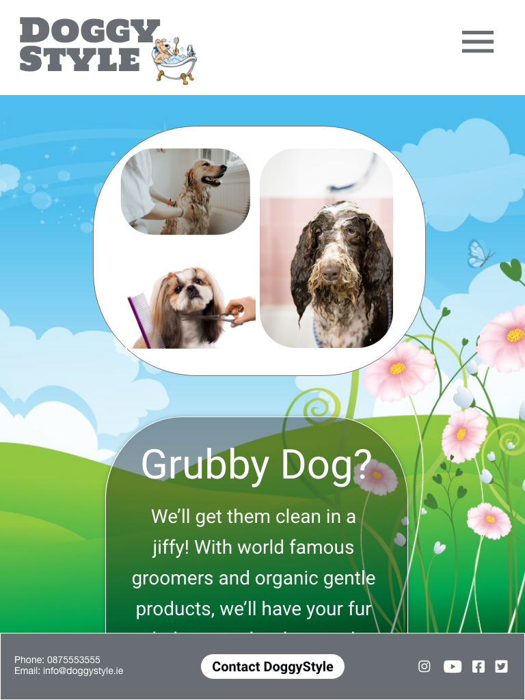
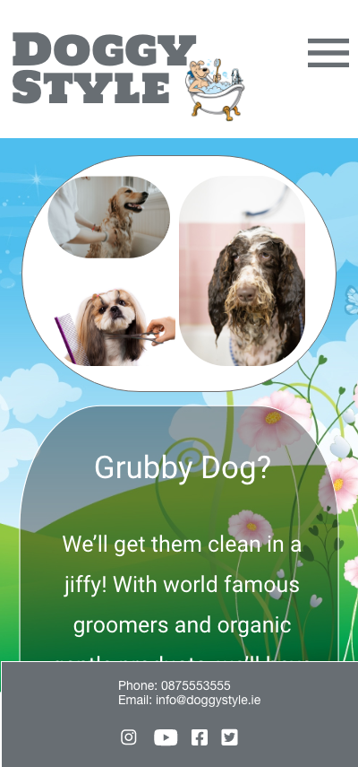

[![homepage][1]][2]

[1]:  assets/images/dslogo.png
[2]:  https://raymondkeogh.github.io/doggystyle/ "Redirect to homepage"

**DoggyStyle website**
==================
Table of content:
-----------------

 - [Description](#description)
 - [User Experience](#user-experience)
     - User Stories
     - Strategy
     - Scope
     - Structure
     - Skeleton
     - Surface
 - [Technologies](#technologies)
 - [Testing](#testing)
 - [Bugs](#bugs)
 - [Deployment](#deployment)
 - [Credits](#credits)

Description
-----------

DoggyStyle is a website for a dog grooming company. This site showcases the clients work and offers a platform for customers to view prices and book appointments. The live site can be viewed [here](https://raymondkeogh.github.io/doggystyle/). 
This site was designed as a project to be submitted for grading in the first milestone project in Full Stack Software Development with the Code Institute. 

User Experience
--------------------

----------

**USER STORIES**

----------

External User Goal:  (In order of priority):

 1. As an external user, I want to find contact details for a dog
    groomer.
 2. As an external user, I want to make a booking for my dog to be
    groomed.
 3. As an external user, I want to see examples of work done by the dog
    groomer.
 4. As an external user, I want to check the prices for the grooming
    services.
 5. As an external user, I want to see what services are offered.
 6. As an external user, I want to see where the dog groomers is
    located.
 7. As an external user, I want to be able to view the site on my mobile
    phone or tablet.

Site Owner Goal:

 1. As the site owner, I would like to offer a portal for clients to
    book appointments.
 2. As the site owner, I would like to advertise my contact details and
    location.
 3. As the site owner, I want to increase the profile of my business and
    have a website I can direct potential customers.
 4. As the site owner, I would like to display my prices and services.
 5. As the site owner, I want to showcase the work that I do.

The mockup for this site was done on Adobe Xd. 
[https://xd.adobe.com/view/f6aca366-5b35-47df-9ab1-72c1e0584183-a3ff/](https://xd.adobe.com/view/f6aca366-5b35-47df-9ab1-72c1e0584183-a3ff/)

The mockups can also be viewed on pdf by clicking on the following [link](assets/images/mockups/mockup.pdf)
----------

**STRATEGY**

--------

 - Focus: The main focus of this project is to provide a portal for the
   client to increase their bookings and make it easier for
   customers to make contact.
 - Definition: We’ll be creating a website that has a very simple layout
   and, with as little effort as possible allows the users navigate and
   make contact with the business. As this may be the users first
   interaction with the business we want to present a clean, fresh and
   seamless experience. It is important to make a good first impression
   assuring the user that they are in the hands of a caring,
   professional business that will be looking after their dog.
 - Value: Creating an clean and simple portal with multiple avenues to
   initiate contact with the business should make it easier to increase
   interactions with new customers whilst increasing the profile of the
   business. This site will also offer the business a legitimate online
   location where they can direct potential clients to view their work,
   services and prices.

----------

**SCOPE**

----------

Features: 

 - Navigation menu – a simple navigation menu offering the user the
   ability to access the areas mentioned in the users, namely, Prices,
   Gallery and Contact.

 - Footer - There will be a footer containing contact detail, social links and another call to action. 
All the of the pages on the site will have the same header and footer elements, background and imagery. Once the home page is created, this template will be duplicated adding in the unique sections for each page. These will be:
 - Home pages - Sales message containing text with a button below to initiate contact. 
 - Contact pages – a contact form requesting name, email address, phone number and a comment section. 
 - Gallery - A gallery containing a selection photographs
 - Prices page - A text window on the prices pages containing the text of the business prices. 

Constraints:
Working with HTML and CSS I will be able to meet the needs of the client as well as tackling each of the scenarios in the user story effectively. However using these technologies alone will limit the site to CSS animations which will be effective but basic.

----------

**STRUCTURE**

----------

The site must be structured in a way in order to effectively achieve the clients main goal. Taking all the user stories into account it was decided that the main focuses of the site will be,

1.	Call to action – sales message with booking button.  

- As the site owner, I would like to offer a portal for clients to
book appointments.
- As the site owner, I would like to advertise my contact details and
location.
- As an external user, I want to find contact details for a dog
groomer.
- As an external user, I want to make a booking for my dog to be
groomed.

With this in mind we will focus on drawing the eye of the user to the main sales message on the home page, creating an effortless flow towards the initiation of contact. Contact details will also be available on the lower left corner and a contact button in the centre of the footer of every page. 

2.	Prices and services available.
- As the site owner, I would like to display my prices and services.
- As an external user, I want to check the prices for the grooming
services.
- As an external user, I want to see what services are offered.

The prices sections will be clearly labelled on the main page in the navigation menu and once clicked will open a clear list of services and associated prices.

 3. Evidence of work – gallery of past work.
- As an external user, I want to see examples of work done by the dog
groomer.
- As the site owner, I want to showcase the work that I do.

The gallery will be equally as visible on the main navigation menu opening up a selection of photographs for the user to scroll through. There will also be a small section on the main page that has select pictures in it. On clicking these images you will be brought to the gallery page. 

The contact page will contain a google maps iframe showing the location of the business 

- As an external user, I want to see where the dog groomers is
located.

The entire website will be optimised to be viewed on mobile devices and a variety of screen sizes.

- As an external user, I want to be able to view the site on my mobile
phone or tablet.

The overall result will be a cohesive, visually appealing and intuitive website reinforcing the clients brand image. 

- As the site owner, I want to increase the profile of my business and
have a website I can direct potential customers.
 
Adobe Xd - DoggyStyle website mockup [https://xd.adobe.com/view/f6aca366-5b35-47df-9ab1-72c1e0584183-a3ff/](https://xd.adobe.com/view/f6aca366-5b35-47df-9ab1-72c1e0584183-a3ff/)

----------

**SURFACE**

----------

Given the nature of this business, image is quite important so the aesthetic of the site must reflect that. 

Colours: 

 - To achieve a fresh clean image we will be using a palette of greens
   blues, white and grey.

Typography: 

 - Holtwood One SC font is used on the main logo and will be repeated in
   the menu items in the navigation bar and Sans Serif as the backup
   font.
 - Roboto will be used for content in the main body of the page with
   Sans Serif as the backup. I chose Roboto for its clean line and as it
   pairs nicely with Holtwood One SC.

Effects:

 - To offer feedback on the buttons I will be incorporating a shadow
   effect which disappears when clicked to give the impression of a 3
   dimensional button.
 - I will also have a hover effect over the menu items in the navigation
   bar using Font Awesome icons offering the use more feedback on what
   they are about to click. This effect will be repeated in the footer element for the contact number and email address indicating that they can be interacted with.
 - The active page will also display the Font Awesome icon to indicate
   to the user which part of the site they are currently on.

Imagery: 

 - We will use an image of a field, the sky, clouds and some flowers as
   the background. This will be framed by a soft grey on the bottom and
   a white on top and will be repeated on each page. The image will be
   simple as to avoid any distraction from the main message on the page

Deviations from design:

The overall structure has remained the same however I have added a google iFrame element to the contact page showing the address and location of the business. 
On the prices page I added a second box containing services available where there was previously just a list of prices per dog. 

Technologies
----------------

 - HTML5 – I used HTML to create the websites main structures
 - CSS3. – I will use CSS to style the components created with HTML and
   create the desired effects described in the ‘Surface’ section.
 - Bootstrap – I decided to use Bootstrap in order to create structures
   on the site and ensure responsiveness.
 - FontAwesome  - The icons from this library are used for the
   navigation icons
 - Google Fonts – Roboto and Holtwood One SC are imported from here.
 - GitPod – IDE used for working on my code
 - GitHub – Used for hosting the files used for the website.
 - Git – Version control used to track changes, commit and push code to
   Github.
 - Pixlr - used for editing images for the website and creating png files.   
 - W3 HTML Validation was done via [https://validator.w3.org/](https://validator.w3.org/)
 - W3 CSS Validation was done via [https://jigsaw.w3.org/css-validator/](https://jigsaw.w3.org/css-validator/)
 - Gitpod extensions:
     - Auto Close Tag
     - Bracket Pair Colorizer
     - Code Spellchecker
     - Prettier - Code Formatter
     - Indent-Rainbow
 - I used Techsini website to create a multi mockup of the live website display at the head of my Readme file. http://techsini.com/multi-mockup/index.php
 - Brackets - Local IDE.
 - Autoprefixer Parses CSS and adds vendor prefixes.[https://autoprefixer.github.io/](https://autoprefixer.github.io/)
 - Google mobile-friendly Test - https://search.google.com/test/mobile-friendly?id=PM7sy6dG9tEXLsvHooNW6Q
 - Website speed test from multiple locations around the globe using real browsers (IE and Chrome) and at real consumer connection speeds.shttps://www.webpagetest.org/result/201121_DiAZ_f0035ae75885410bc1ba7907017673b9/

Testing
-------

In order to comprehensively test the website, criteria for a successful launch must be established. 
1. All links on the website must connect to the correct location. 
2. All images and elements on website must load correctly. 
3. All fallback fonts must work visually should the first choice fonts be unavailable. 
4. All elements on the website must be responsive, resizing for different screen sizes and maintaining their integrity with no overlapping. 
5. All photos in gallery must be clickable, expand to full size and be closable. This must be achievable in both desktop and mobile screen layouts. They must also respond to hover by expanding by 1.2x their original size. The photos should also have an arrow for scrolling through the gallery in fullscreen.
6. All external links direct to the correct website.
7. The website loads correctly and functions on Chrome, Internet Explorer, Safari and Firefox browsers.
8. The website performs as required as outlined in User Stories for external users and the site owner.

[![homepage][3]][4]

[3]:  assets/testing/testing-screenshot.png
[4]:  assets/testing/MS1-testing.numbers "Redirect to testing spreadsheet"

All testing is documented in the MS1-Testing Mac Numbers [spreadsheet](assets/testing/MS1-testing.numbers), [Excel](assets/testing/MS1-testing.xlsx) and in [pdf](assets/testing/MS1-testing.pdf) format

W3 HTML Validation was done via [https://validator.w3.org/](https://validator.w3.org/).

W3 CSS Validation was done via [https://jigsaw.w3.org/css-validator/](https://jigsaw.w3.org/css-validator/)

Bugs
-------

Bug: Site logo shift from left to right hand side of screen when width of screen drops below 992px. 
Fix: Changed position to absolute and positioned left and top to 0.

Bug: Contact button in footer covers the Phone number and email section when screen goes below 578px. 
Fix: set contact details to display:none as the footer was too cluttered. 

Bug: I initially used bootsraps buttons but had issues with specificity and applying styles
to the class I created for button.  
Fix: I considered giving the body an id tag but decided
copying the bootstrap button parameters and styling my own button in order create the 3d click effect using box-shadow and display properties.

Bug: On creating a parallax effect for the background when scrolling rather than keeping the background fixed there is a white band being pulled up when scrolling to bottom. 
Fix: Changed position on the ‘sales-pitch’ element from ‘absolute’ to ‘relative’.

Bug: The phone number input is allowing characters even though ‘tel’ validation is set in the input. 
Fix: None as of yet. The fix for this bug is outside the remit of this project. 

Bug: The header and footer have a gap on the right hand side.  
Fix: Moved the footer into a div and gave the div class ".container-fluid"

Bug: The footer is jumping up when reducing the screen size.  
Fix: I had erroneously put a media query in 'table screen size' section. Footer fine once code removed.

Bug: After W3 Validation for CSS and HTML the gallery navigation and close buttons are missing. 
Fix: I had somehow deleted the script link for lightbox. 

Bug: After W3 Validation for CSS and HTML I changed a button inside a anchor tag to a form to pass the validation. The buttons did not click through to link. 
Fix: I had incorrectly placed a button inside a form when it should have been an input field. 

Deployment
----------

The following steps were taken to deploy the website. 
1. Create a GitHub account at [https://www.github.com](https://www.github.com). locate the DoggyStyle repository for the website. The link is here. [https://github.com/raymondkeogh/doggystyle](https://github.com/raymondkeogh/doggystyle). 
2. Click on the setting cog in the centre right near the top of the page. 
3. Scroll down to the section that says GitHub Pages. 
4. Ensure 'branch: master' is selected.
5. Click 'Save' 
6. The site link will be displayed above this section where is says  'Your site is published at - .....'
7. Click the link to open the website in a new tab and the website is deployed!

More information on github pages can be found [here](https://pages.github.com/).

In order to run this project there a couple of methods you can use. The first is for use with a cloud based IDE called Gitpod and the second is for use in a local IDE of your choice e.g. VSCode.  

Run in Gitpod:

1. Create a GitHub account at [https://www.github.com](https://www.github.com). 
2. Install the gitpod browser extension for Chrome browser.
3. Restart the Chrome browser.
4. Log into [GitPod](https://www.gitpod.io/) using your GitHub account. 
5. Next open GitHub and locate the DoggyStyle repository for the website at [https://github.com/raymondkeogh/doggystyle](https://github.com/raymondkeogh/doggystyle)
6. Click on the green GitPod button in the top right hands side of the screen. 
7. This will open a new GitPod workspace with the DoggyStyle respository files in it. 

Run in Local IDE:

1. GitHub and locate the DoggyStyle repository for the website. The link is here. [https://github.com/raymondkeogh/doggystyle](https://github.com/raymondkeogh/doggystyle). 
2. Click on the the button near the top of the page that says "Code"
3. In the box that pops up under the HTTPS section copy the URL. 
4. In your local IDE open the command terminal. 
5. Change the working directory to the location where you will be working on the project. 
6. Type in 'git clone' and the url you got from the HTTPS popup from the code button. 
7. Press enter to create you local clone. 
8. Happy Coding!

Credits
-------

**Code used**

I altered this bootsrap code for my navbar. [https://getbootstrap.com/docs/4.0/components/navbar/]
(https://getbootstrap.com/docs/4.0/components/navbar/) 

 I found this bit of code on stackoverflow which helped me understand how to display the active page link. 
[https://stackoverflow.com/questions/17318170/highlighting-the-current-page-in-a-list-of-links-using-css-html](https://stackoverflow.com/questions/17318170/highlighting-the-current-page-in-a-list-of-links-using-css-html)

I used this code to help create the scrolling effect on the website.
[https://www.w3schools.com/howto/tryhow_css_parallax_demo.htm](https://www.w3schools.com/howto/tryhow_css_parallax_demo.htm)
**Content**

Image used for site icon [https://www.clipartmax.com/middle/m2K9A0A0i8m2m2d3_bathroom-bath-clipart-free-download-clip-art-on-bathing-clip-art/](https://www.clipartmax.com/middle/m2K9A0A0i8m2m2d3_bathroom-bath-clipart-free-download-clip-art-on-bathing-clip-art/)

The background image for the website - [https://all-free-download.com/free-vector/download/spring-background_310720.html](https://all-free-download.com/free-vector/download/spring-background_310720.html)

Some images for gallery were taken from  [https://unsplash.com/](https://unsplash.com/) while the handsome brown and white collie is my Dog Derek. 

I used lightbox to create gallery effect 
[https://lokeshdhakar.com/projects/lightbox2/](https://lokeshdhakar.com/projects/lightbox2/)
and the following tutorial by Clever Techie to help me create the gallery 
[https://clevertechie.com/html-css/157/how-to-create-image-gallery-using-html-css-javascript](https://clevertechie.com/html-css/157/how-to-create-image-gallery-using-html-css-javascript)

I used the price list from [Glamourdogs.ie](https://www.glamourdogs.ie/grooming-price.html) to create the text content for my prices page. 

**Acknowledgements**

I would like to thank:

- My mentor Maranatha Ilesanmi for brilliant guidance on this project and being really generous with his time. 
- Fellow student Daisy Mc Girr for guiding me with her amazing testing skills despite having 4 kids, a job and her own projects to work on. 
- The gang on Slack for their awesome tips and support. 

 

